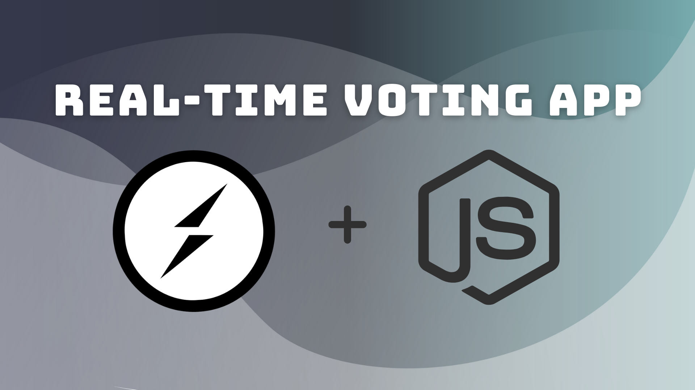

# Caching Layer in Node.js with REDIS.

## >> Getting started



To get started with this project, run

```bash
git clone https://github.com/Vishakha-Sawra/websocket-vote-app.git
```

## >> Start the server

```bash
cd server
pnpm install
```

And then in terminal run the command **npm start** to start the server, and it will run on localhost:8000

```bash
  npm start
```

## >> Start the client

And for starting client, open another terminal, naviagte to client folder and install the dependencies by running the command **pnpm install** and then run the command **pnpm start** to start the client, and it will run on localhost:5173

```bash
cd client
pnpm install
pnpm run dev
```
And then check the App on localhost:5173.